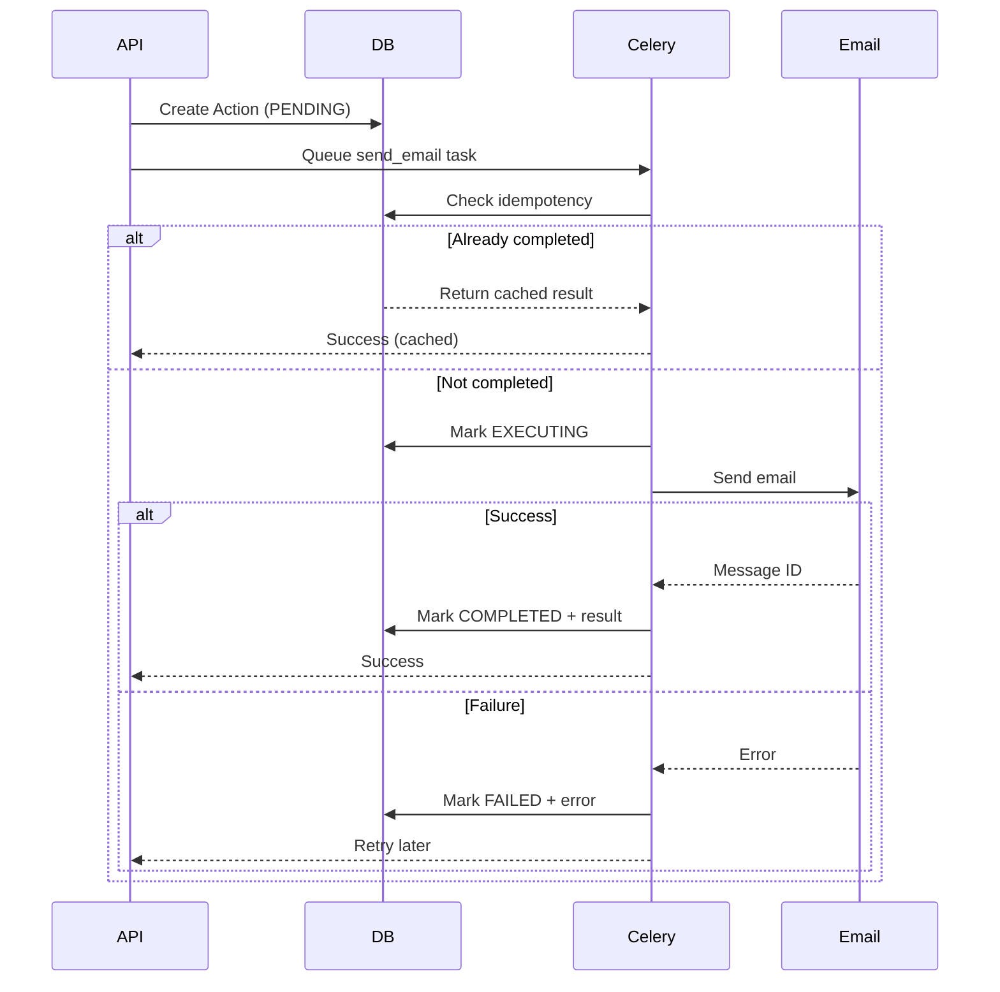

# Persistence and Recovery Patterns

## Overview

NCII Shield implements a robust persistence layer that guarantees exactly-once execution of all outbound actions (emails, API calls, webhooks) even in the face of crashes, network failures, or unexpected restarts.

## Core Principles

### 1. Write-Before-Act Pattern

Every outbound action follows this sequence:
1. **Write intent** to database with status `PENDING`
2. **Check for duplicates** using idempotency key
3. **Mark as executing** before starting work
4. **Execute the action**
5. **Update status** to `COMPLETED` or `FAILED`

This ensures that even if the system crashes at step 4, we can recover and retry.

### 2. Idempotency

All actions use UUID-based idempotency keys to prevent duplicate execution:
- Same key → Same result
- Failed actions can be retried
- Completed actions return cached result

### 3. Recovery on Boot

When a worker starts:
1. Scans for interrupted actions:
   - PENDING actions > 5 minutes old
   - EXECUTING actions with stale heartbeat (> 2 minutes old)
   - EXECUTING actions with no heartbeat > 5 minutes old
2. Resets them to PENDING
3. Re-enqueues for execution
4. Checks for targets due for next action

### 4. Heartbeat Support

Long-running tasks send heartbeats every 30 seconds:
- Background thread updates `last_heartbeat_at`
- Recovery checks heartbeat age instead of creation age
- Prevents false-positive recovery on legitimate long tasks
- Heartbeat stops automatically on completion/failure

### 5. Graceful Shutdown

On SIGTERM:
1. Finish current task (up to 30s grace period)
2. Stop heartbeat threads
3. Mark any EXECUTING actions back to PENDING
4. Write audit log entries
5. Clean shutdown

## Implementation

### Using the Idempotent Action Wrapper

#### As a Context Manager

```python
from app.persistence import idempotent_action
from app.models.action import ActionType

def send_takedown_email(target_id: int, email_content: str):
    # Generate unique key for this specific email
    idempotency_key = f"email-{target_id}-{hash(email_content)}"

    with idempotent_action(
        target_id=target_id,
        action_type=ActionType.EMAIL_INITIAL,
        idempotency_key=idempotency_key
    ) as action:
        # Check if already completed
        if action.is_already_completed():
            return action.get_result()

        # Mark as executing
        action.mark_executing()

        # Do the actual work
        # Heartbeats automatically sent every 30s while this runs
        response = email_api.send(
            to=contact.email,
            subject=f"[Case-{target.case_id}] Content Removal Request",
            body=email_content
        )

        # Store result
        action.action.payload["result"] = {
            "message_id": response.id,
            "sent_at": datetime.utcnow().isoformat()
        }

        return action.action.payload["result"]
```

#### As a Decorator for Celery Tasks

```python
from app.persistence import idempotent_task
from app.celery_app import celery_app

@celery_app.task
@idempotent_task(ActionType.EMAIL_INITIAL)
def send_email_task(target_id: int, action_id: int, **kwargs):
    # The decorator handles all persistence logic
    # Just implement the actual work

    response = email_api.send(...)
    return {"message_id": response.id}
```

### Recovery Worker

The recovery worker runs:
1. **On worker startup** - via Celery signal
2. **Every 5 minutes** - via Celery beat
3. **On demand** - can be triggered manually

```python
from app.persistence.recovery import run_recovery_task

# Manual trigger
result = run_recovery_task()
print(f"Recovered {len(result['recovered_actions'])} actions")
print(f"Scheduled {len(result['scheduled_targets'])} targets")
```

## Database Schema

### Actions Table (Append-Only)

```sql
CREATE TABLE actions (
    id INTEGER PRIMARY KEY,
    target_id INTEGER NOT NULL,
    type VARCHAR NOT NULL,  -- email_initial, email_followup, etc.
    payload JSONB,          -- Includes idempotency_key
    status VARCHAR NOT NULL,  -- pending, executing, completed, failed
    scheduled_at TIMESTAMP,
    executed_at TIMESTAMP,
    created_at TIMESTAMP NOT NULL,
    last_heartbeat_at TIMESTAMP,  -- For long-running task monitoring
    error_message TEXT,

    FOREIGN KEY (target_id) REFERENCES targets(id)
);

CREATE INDEX idx_actions_status ON actions(status);
CREATE INDEX idx_actions_scheduled_at ON actions(scheduled_at);
CREATE INDEX idx_actions_last_heartbeat_at ON actions(last_heartbeat_at);
CREATE INDEX idx_actions_idempotency ON actions((payload->>'idempotency_key'));
```

### Audit Trail

Every state change creates an audit log entry:
```json
{
    "entity_type": "action",
    "entity_id": 123,
    "action": "status_changed",
    "old_value": {"status": "pending"},
    "new_value": {"status": "executing"},
    "created_at": "2024-04-24T12:00:00Z"
}
```

## Redis Configuration

AOF (Append Only File) persistence ensures Celery task queue survives restarts:

```
appendonly yes              # Enable AOF
appendfsync everysec       # Sync to disk every second
aof-rewrite-incremental-fsync yes  # Incremental rewrites
aof-load-truncated yes     # Load even if truncated
```

## Testing Recovery

### Unit Test

```python
def test_idempotent_execution():
    # First call executes
    result1 = send_email_with_idempotency("key-123")

    # Second call returns cached result
    result2 = send_email_with_idempotency("key-123")

    assert result1 == result2
    assert email_api.send.call_count == 1  # Only called once
```

### Integration Test

```bash
# Run the integration test that:
# 1. Starts a long task
# 2. Kills worker mid-execution
# 3. Restarts worker
# 4. Verifies task completes

cd backend
pytest tests/integration/test_recovery.py::TestCeleryWorkerRecovery::test_worker_crash_recovery -v
```

## Monitoring

### Health Checks

```python
# Check for stuck actions based on heartbeat
stuck_actions = db.query(Action).filter(
    and_(
        Action.status == ActionStatus.EXECUTING,
        or_(
            # Has heartbeat but it's stale
            and_(
                Action.last_heartbeat_at.isnot(None),
                Action.last_heartbeat_at < datetime.utcnow() - timedelta(minutes=2)
            ),
            # No heartbeat and old
            and_(
                Action.last_heartbeat_at.is_(None),
                Action.created_at < datetime.utcnow() - timedelta(minutes=5)
            )
        )
    )
).count()

if stuck_actions > 0:
    alert("Found {} stuck actions", stuck_actions)
```

### Metrics to Track

1. **Action completion rate** - Completed vs Failed
2. **Recovery frequency** - How often recovery finds work
3. **Idempotency hit rate** - Duplicate attempts prevented
4. **Queue depth** - Pending actions count

## Best Practices

### DO

✅ Always use idempotent wrappers for external calls
✅ Generate deterministic idempotency keys
✅ Store enough context to retry operations
✅ Log all state transitions
✅ Test recovery scenarios

### DON'T

❌ Don't perform side effects before writing to DB
❌ Don't use timestamps in idempotency keys
❌ Don't assume operations are atomic
❌ Don't ignore failed actions
❌ Don't bypass the persistence layer

## Failure Scenarios Handled

1. **Process crash during execution**
   - Recovery worker finds EXECUTING action with stale/missing heartbeat
   - Resets to PENDING
   - Re-enqueues for retry

2. **Database connection lost**
   - Action stays in PENDING
   - Retried when connection restored

3. **External API timeout**
   - Action marked FAILED with error
   - Can be retried with same idempotency key

4. **Worker killed (SIGTERM)**
   - Current task finishes (30s grace)
   - EXECUTING → PENDING
   - Next worker picks it up

5. **Redis restart**
   - AOF restores queue state
   - Recovery worker re-enqueues any missing

## Example: Email Send Flow



## Troubleshooting

### Actions stuck in EXECUTING

```sql
-- Find stuck actions based on heartbeat
SELECT id, target_id, type, created_at, last_heartbeat_at
FROM actions
WHERE status = 'executing'
  AND (
    -- Stale heartbeat
    (last_heartbeat_at IS NOT NULL AND last_heartbeat_at < NOW() - INTERVAL '2 minutes')
    OR
    -- No heartbeat and old
    (last_heartbeat_at IS NULL AND created_at < NOW() - INTERVAL '5 minutes')
  );

-- Reset to pending (recovery will handle)
UPDATE actions
SET status = 'pending'
WHERE status = 'executing'
  AND (
    (last_heartbeat_at IS NOT NULL AND last_heartbeat_at < NOW() - INTERVAL '2 minutes')
    OR
    (last_heartbeat_at IS NULL AND created_at < NOW() - INTERVAL '5 minutes')
  );
```

### Duplicate actions created

Check idempotency key generation:
```python
# Bad - includes timestamp
key = f"email-{target_id}-{datetime.now()}"

# Good - deterministic
key = f"email-{target_id}-{content_hash}"
```

### Recovery not running

Check Celery beat is running:
```bash
docker compose ps celery-beat
docker compose logs celery-beat
```

Manually trigger recovery:
```bash
docker compose exec celery-worker python -c "
from app.persistence.recovery import run_recovery_task
print(run_recovery_task())
"
```